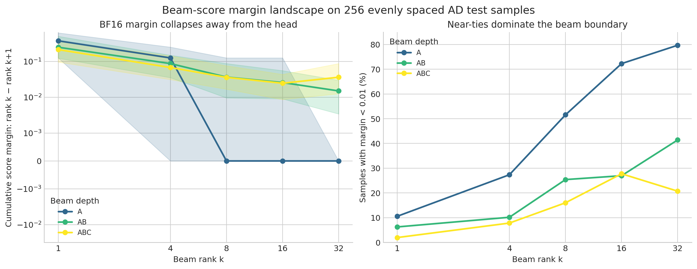
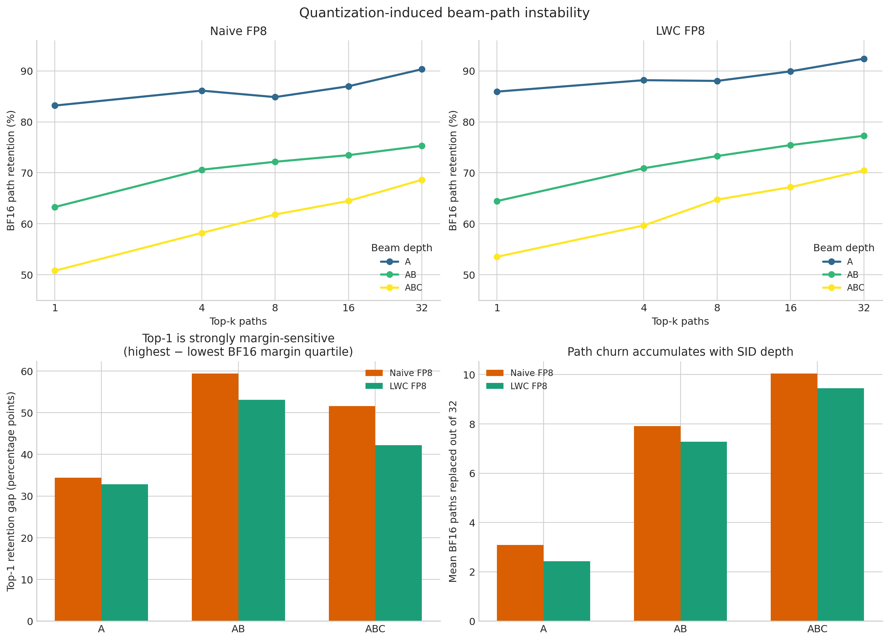

# AD Beam Margin 256-sample Probe

## 1. 研究问题

前一个全量 final-beam probe 发现：FP8 在较小 K 上的 GT 命中率变化较小，但随着 SID 深度和 K 增大，路径集合及推荐指标的差距扩大。本 probe 检验以下机制假设：

> 高分头部候选之间的 margin 较大，因此量化后相对稳定；中部及 beam 截断边界附近分数更平坦，量化扰动容易改变大量候选的相对排名，进而在较大 K 和更深 SID 路径上累积为覆盖损失。

## 2. 实验设置

- 数据：AD test 全量 27,677 条中的 256 条，按有序测试集等间隔取每段中点，覆盖 sample ID 54～27,622。
- 模型：1.7B BF16、naive FP8 W8A8、symmetric LWC/no-LET FP8 W8A8。
- LWC checkpoint：`artifacts/results/fake_quant/omniquant_sym_lwc_nolet_fp8w_fp8a_calib128_ad/1.7B/ad/omniquant_calibration`
- 搜索：与正式评测一致，`num_beams=32`、返回 32 条、生成 A/B/C 三步，不额外施加 SID vocabulary constraint。
- 设备：物理 CUDA 7；设置 `CUDA_VISIBLE_DEVICES=7` 后，进程内设备显示为 `cuda:0`。
- 运行时间：BF16 136.9 秒，naive FP8 228.5 秒，LWC FP8 228.9 秒。

每一步都复现当前 Transformers beam search 内部的两次 `topk`，维护累计路径 log-prob，并定义：

```text
margin@k = cumulative_beam_score(rank k) - cumulative_beam_score(rank k+1)
```

因此这里测量的不是某个固定前缀下的普通 token-logit gap，而是当步所有存活父路径展开后的 **全局累计 beam admission margin**。

## 3. 实现校验

- 三组模型、三个深度选中的 73,728 个路径 token 全部属于正确的 A/B/C slot。
- top-32 中没有提前 EOS。
- 三组模型 256/256 条样本的重建最终路径集合都与 `model.generate()` 返回集合完全一致。
- 最终路径的严格顺序分别有 178/256、166/256、158/256 条完全一致；集合全部一致而顺序偶有差别，来自相同或极近分数下 `topk` 的非稳定 tie ordering。本文的集合 overlap 不受影响。

## 4. BF16 自身的 margin 结构



图中左侧实线为中位 margin，阴影为 25%～75% 分位区间；右侧展示 `margin < 0.01` 的 near-tie 比例。纵轴使用 symlog，以便同时显示 0 margin 和较大的 head margin。

### 4.1 中位 margin

| Beam depth | rank 1 | rank 4 | rank 8 | rank 16 | rank 32 |
|---|---:|---:|---:|---:|---:|
| A | 0.3750 | 0.1250 | 0.0000 | 0.0000 | 0.0000 |
| AB | 0.2484 | 0.0869 | 0.0365 | 0.0257 | 0.0150 |
| ABC | 0.2133 | 0.0675 | 0.0358 | 0.0246 | 0.0361 |

### 4.2 近似并列的样本比例

下表统计 `margin < 0.01` 的样本比例。

| Beam depth | rank 1 | rank 4 | rank 8 | rank 16 | rank 32 |
|---|---:|---:|---:|---:|---:|
| A | 10.5% | 27.3% | 51.6% | 72.3% | 79.7% |
| AB | 6.3% | 10.2% | 25.4% | 27.0% | 41.4% |
| ABC | 2.0% | 7.8% | 16.0% | 27.7% | 20.7% |

结果非常明确：

- A 阶段 rank-1 的平均 margin 为 0.436，rank-32 只有 0.0254，约缩小 17 倍；rank-32 的中位 margin 已经为 0。
- AB 阶段 rank-1 与 rank-32 的中位 margin 分别为 0.248 和 0.015，约相差 16.6 倍。
- ABC 阶段不是严格单调，但 rank-1 中位 margin 仍约为 rank-32 的 5.9 倍。

A margin 出现大量精确 0，与 BF16 输出头的有限数值分辨率以及大量近似并列候选有关。这意味着即使不做量化，beam 边界本身就相当脆弱；FP8 的小扰动很容易改变 tie breaking 和边界成员。

## 5. BF16 与量化模型的真实中间 beam overlap



上排比较不同 K 下的 BF16 路径保留率；左下展示最高与最低 BF16 margin 四分位之间的 top-1 稳定性差距；右下展示 top-32 中被量化模型换出的平均路径数。

表中数值表示 BF16 top-k 路径仍出现在量化模型同深度 top-k 中的平均比例。A、AB 是真实中间 beam，而不是从最终 ABC 路径反推得到的前缀。

| Candidate | Depth | k=1 | k=4 | k=8 | k=16 | k=32 | top-32 平均换出路径数 |
|---|---|---:|---:|---:|---:|---:|---:|
| Naive FP8 | A | 83.2% | 86.1% | 84.9% | 87.0% | 90.3% | 3.09 |
| Naive FP8 | AB | 63.3% | 70.6% | 72.2% | 73.5% | 75.3% | 7.91 |
| Naive FP8 | ABC | 50.8% | 58.2% | 61.8% | 64.5% | 68.6% | 10.04 |
| LWC FP8 | A | 85.9% | 88.2% | 88.0% | 89.9% | 92.4% | 2.43 |
| LWC FP8 | AB | 64.5% | 70.9% | 73.3% | 75.4% | 77.3% | 7.27 |
| LWC FP8 | ABC | 53.5% | 59.7% | 64.7% | 67.2% | 70.5% | 9.45 |

这里需要区分“比例”和“数量”：top-32 的相对 overlap 高于 top-1，但因为集合更大，实际换出的路径数明显增加。例如 naive FP8 平均换出约 3.1 条 A、7.9 条 AB 和 10.0 条 ABC 路径。量化扰动随自回归深度累积得非常明显。

这一结果也修正了此前仅从最终 beam 前缀推断得到的理解：

- 第一步真正的 top-1 A token 在 naive FP8 中有 83.2% 保持不变，说明最初的高概率 A 决策相对稳定。
- 到 AB top-1 时只剩 63.3% 一致。
- 到完整 ABC top-1 时只剩 50.8% 一致。

因此“头部稳定”对第一步 A 基本成立，但不能推广为完整路径头部稳定；B/C 条件分布与累计路径分数会继续放大差异。

## 6. 小 margin 是否真的对应更大的排名扰动

按 BF16 margin 将 256 条样本分为四分位，比较最低与最高 margin 四分位中的 BF16→naive FP8 路径保留率。

### 6.1 Top-1

| Depth | 最低 margin 四分位 | 最高 margin 四分位 | Pearson(log-margin, retention) |
|---|---:|---:|---:|
| A | 65.6% | 100.0% | 0.287 |
| AB | 32.8% | 92.2% | 0.229 |
| ABC | 25.0% | 76.6% | 0.334 |

对于 top-1，证据很强：BF16 头部 margin 越大，量化后最高分路径越可能保持不变。尤其 AB/ABC 的低 margin 样本，top-1 路径极易被替换。

### 6.2 Top-32

| Depth | 最低 margin 四分位 | 最高 margin 四分位 | Pearson(log-margin, retention) |
|---|---:|---:|---:|
| A | 90.2% | 91.1% | 0.117 |
| AB | 75.1% | 76.3% | 0.032 |
| ABC | 67.6% | 68.4% | 0.063 |

但在 top-32 上，单独使用 `rank32-rank33` margin 几乎无法解释样本间的整个集合 churn。原因包括：

1. 大量样本的 rank-32 margin 都已经接近 0，指标出现饱和，缺少区分度。
2. top-32 集合变化不是只交换第 32/33 名；量化会同时扰动整个中部候选区。
3. B/C 的候选池依赖上一阶段保留下来的父路径，上游 A/AB 变化会改变后续候选空间。
4. 每条路径累计三个条件 log-prob，早期的微小位移会在后续继续传播。

所以，“中部平坦导致敏感”得到了结构性支持，但 **某一个 cutoff margin 并不是大 K 误差的充分预测指标**。

## 7. LWC 的表现

LWC 相比 naive FP8 在所有深度、所有 K 上都提高了与 BF16 的平均路径 overlap。例如 top-32：

- A：90.3% → 92.4%；
- AB：75.3% → 77.3%；
- ABC：68.6% → 70.5%。

这再次证明 LWC 确实让量化 beam 更接近 BF16，而不只是降低局部 block MSE。

但 LWC 并没有统一扩大所有 margin。AB 阶段尤其值得注意：

| Model | AB rank-1 median margin | AB rank-32 median margin | AB rank-32 `margin<0.01` |
|---|---:|---:|---:|
| BF16 | 0.2484 | 0.0150 | 41.4% |
| Naive FP8 | 0.2564 | 0.0164 | 39.1% |
| LWC FP8 | 0.3053 | 0.0116 | 47.7% |

LWC 把 AB 的头部拉得更开，却把 rank-32 附近变得更平。这与前一个全量 probe 观察到的“LWC 条件路径更接近 BF16，但 beam breadth 有所收窄”是吻合的：它可能增强少数高分路径的集中度，而没有改善边界候选的分离。

## 8. GT 命中只作 sanity check

256 条样本下的 ABC hit@32 为：BF16 20.31%、naive FP8 19.92%、LWC FP8 18.75%。这个小样本上 LWC 低于 naive，但全量 27,677 条中 LWC 是 20.634%、naive 是 20.533%。因此本 probe 的 GT 指标只用于验证数据和路径解析，不用于判断模型最终精度；margin 与 overlap 才是本实验的主要统计对象。

## 9. 结论

原假设可以修改为下面这个更准确的版本：

> BF16 的 beam 头部 margin 通常显著大于中部和截断边界，因此第一步高概率 A token 对 FP8 相对稳定；中部大量候选近似并列，量化扰动会造成显著路径换位。随着 A→AB→ABC 自回归展开，上游候选变化和累计路径分数进一步放大扰动，导致较大 K 下的有效前缀覆盖下降。

这个机制得到了三方面证据支持：

1. rank-1 margin 显著大于 rank-32，A 的 rank-32 中位 margin 为 0；
2. 低 head-margin 四分位的 top-1 路径保留率远低于高-margin 四分位；
3. 平均换出路径数从 A 的 3.1 条扩大到 AB 的 7.9 条和 ABC 的 10.0 条。

同时也应避免把结论简化成“只保护 rank-32/33 的 gap 就能解决问题”：top-32 churn 与单一 cutoff margin 的相关性很弱。后续如果设计 beam-aware 目标，更合理的是约束一段候选带的排序/质量、保持前缀多样性，并覆盖 A、条件 B 和条件 C，而不是只最大化某一个边界 pair 的 margin。
