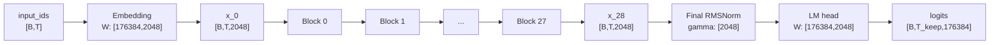
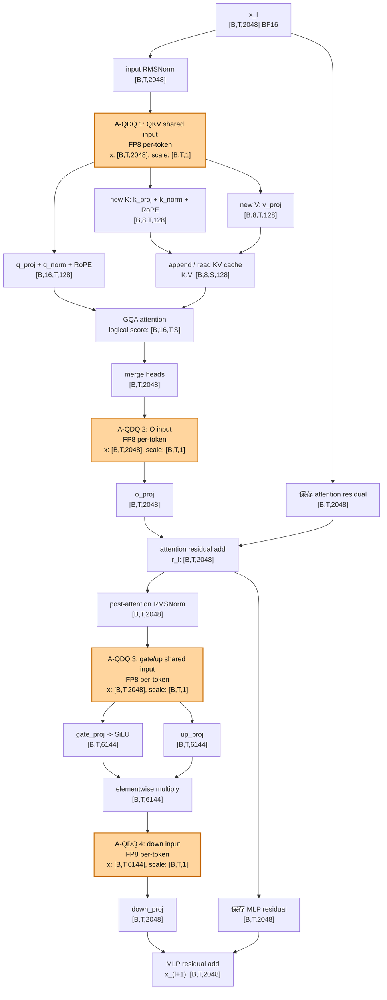
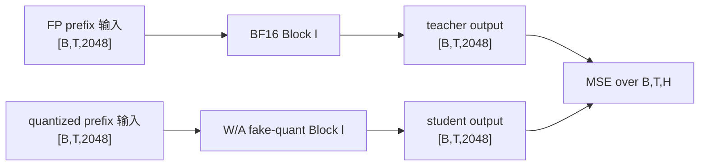
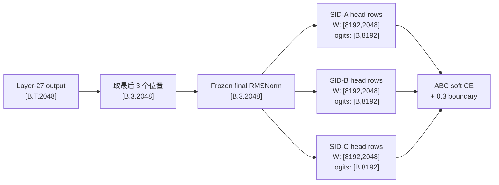

# 当前 OneRec Qwen3-1.7B 数据流与 Shape

本文记录当前主实验所用 `/root/dataDisk/guowei/models/1.7B` 的实际结构，以及
`fake_quant` 主路径中的量化位置。这里描述的是 Qwen3 block 的逻辑数据流；
FP4/FP8 fake-QDQ 最终仍以 BF16 张量执行普通算子。

## 1. Shape 记号与实际配置

| 符号 | 含义 | 当前值 |
|---|---|---:|
| `B` | 有效 batch size；beam search 时可能包含 beam 维 | 动态 |
| `T` | 本次 forward 的 query token 数 | prefill 为序列长度，decode 通常为 1 |
| `S` | attention 可见的 KV 总长度 | `past_length + T` |
| `V` | 全词表大小 | 176384 |
| `H` | residual hidden size | 2048 |
| `I` | MLP intermediate size | 6144 |
| `Nq` | query head 数 | 16 |
| `Nkv` | key/value head 数 | 8 |
| `G` | 每个 KV head 对应的 query head 数 | 2 |
| `D` | head dimension | 128 |
| `L` | decoder block 数 | 28，编号 0–27 |

实际配置还包括：BF16 模型、全 28 层均为 full attention、无 sliding window、
最大位置长度 40960、SiLU MLP、无 Linear bias、tied word embedding。

## 2. 整体模型数据流



每个 `Block l` 都保持 residual shape 不变：

```text
x_l     : [B, T, 2048]
Block l : [B, T, 2048] -> [B, T, 2048]
x_(l+1) : [B, T, 2048]             l = 0, ..., 27
```

Embedding、final RMSNorm 和 LM head 当前不在主方法的量化范围内。每个 block
中的 7 个 Linear 被量化，因此共有 `28 × 7 = 196` 个量化 Linear。

## 3. 单个 Block 的完整数据流

下面的模板适用于 Block 0–27。橙色节点是当前真正发生 activation QDQ 的位置。
Q/K/V 共享一次输入 QDQ，gate/up 共享一次输入 QDQ，所以每个 block 只有 4 个
不同的 activation QDQ 张量。



## 4. Attention 子图逐组件 Shape

Attention 输入是 input RMSNorm 的输出 `n_attn`，shape 为 `[B,T,2048]`。

| 顺序 | 组件 | 输入 | 参数或中间结构 | 输出 |
|---:|---|---|---|---|
| 1 | input RMSNorm | `[B,T,2048]` | `gamma: [2048]` | `[B,T,2048]` |
| 2 | shared QKV activation QDQ | `[B,T,2048]` | per-token scale `[B,T,1]` | `[B,T,2048]` |
| 3 | q_proj | `[B,T,2048]` | `Wq: [2048,2048]` | `[B,T,2048]` |
| 4 | q reshape | `[B,T,2048]` | `16 × 128` | `[B,T,16,128]` |
| 5 | q RMSNorm | `[B,T,16,128]` | shared `gamma_q: [128]` | `[B,T,16,128]` |
| 6 | q transpose | `[B,T,16,128]` | — | `[B,16,T,128]` |
| 7 | k_proj | `[B,T,2048]` | `Wk: [1024,2048]` | `[B,T,1024]` |
| 8 | k reshape + RMSNorm + transpose | `[B,T,1024]` | `8 × 128`, `gamma_k: [128]` | `[B,8,T,128]` |
| 9 | v_proj | `[B,T,2048]` | `Wv: [1024,2048]` | `[B,T,1024]` |
| 10 | v reshape + transpose | `[B,T,1024]` | `8 × 128` | `[B,8,T,128]` |
| 11 | RoPE | Q `[B,16,T,128]`, K `[B,8,T,128]` | cos/sin `[1或B,T,128]`，广播 head 维 | shape 不变 |
| 12 | KV cache update | 新 K/V `[B,8,T,128]` | 与 past K/V 拼接 | K/V `[B,8,S,128]` |
| 13 | GQA logical repeat | K/V `[B,8,S,128]` | 每个 KV head 服务 2 个 Q heads | `[B,16,S,128]` |
| 14 | Q × K transpose | Q `[B,16,T,128]`, K `[B,16,S,128]` | 乘 `1/sqrt(128)` | score `[B,16,T,S]` |
| 15 | causal mask + softmax | score `[B,16,T,S]` | eager 参考实现用 FP32 softmax；融合后端由 kernel 决定 | logical prob `[B,16,T,S]` |
| 16 | prob × V | prob `[B,16,T,S]`, V `[B,16,S,128]` | GQA 的 V 同样逻辑 repeat | `[B,16,T,128]` |
| 17 | transpose + merge heads | `[B,16,T,128]` | `16 × 128 = 2048` | `[B,T,2048]` |
| 18 | O-input activation QDQ | `[B,T,2048]` | per-token scale `[B,T,1]` | `[B,T,2048]` |
| 19 | o_proj | `[B,T,2048]` | `Wo: [2048,2048]` | `[B,T,2048]` |
| 20 | attention residual add | residual 与 attention output 均为 `[B,T,2048]` | elementwise add | `[B,T,2048]` |

注意：GQA repeat 和 attention score 都是逻辑 shape。SDPA/FlashAttention 后端
不一定真的物化 `[B,16,S,128]` 的 K/V、`[B,16,T,S]` 的完整 score 或 probability
张量；其内部 softmax 数值实现也不应直接等同于 eager 参考路径。

当前没有单独量化 q_proj/k_proj/v_proj 的输出，也没有量化 q/k norm、RoPE、
attention score、softmax probability 或 residual。KV cache 保存的是由量化
Linear 产生、但已经反量化回 BF16 的 K/V；当前没有额外的 KV-cache quantizer。

## 5. MLP 子图逐组件 Shape

MLP 输入是 attention residual add 的输出 `r_l`，shape 为 `[B,T,2048]`。

| 顺序 | 组件 | 输入 | 参数或中间结构 | 输出 |
|---:|---|---|---|---|
| 1 | post-attention RMSNorm | `[B,T,2048]` | `gamma: [2048]` | `[B,T,2048]` |
| 2 | shared gate/up activation QDQ | `[B,T,2048]` | per-token scale `[B,T,1]` | `[B,T,2048]` |
| 3 | gate_proj | `[B,T,2048]` | `W_gate: [6144,2048]` | `[B,T,6144]` |
| 4 | SiLU | `[B,T,6144]` | elementwise | `[B,T,6144]` |
| 5 | up_proj | `[B,T,2048]` | `W_up: [6144,2048]` | `[B,T,6144]` |
| 6 | gated multiply | 两个 `[B,T,6144]` | `SiLU(gate) * up` | `[B,T,6144]` |
| 7 | down-input activation QDQ | `[B,T,6144]` | per-token scale `[B,T,1]` | `[B,T,6144]` |
| 8 | down_proj | `[B,T,6144]` | `W_down: [2048,6144]` | `[B,T,2048]` |
| 9 | MLP residual add | residual 与 MLP output 均为 `[B,T,2048]` | elementwise add | `[B,T,2048]` |

`SiLU(gate) * up` 是 block 内唯一把 hidden width 从 2048 扩展到 6144 后进行
乘性组合的激活。它没有被单独保存成低精度张量，但它正是 down_proj 的量化输入。

## 6. 当前 Activation QDQ 的精确定义

对任意 Linear 输入 `X`，最后一维是该 Linear 的 `in_features`。对每个
`(batch, token)` 行独立计算：

$$
s_{b,t}=\frac{\max(\max_c |X_{b,t,c}|,\epsilon)}{448},
\qquad
\widehat X_{b,t,:}=s_{b,t}\cdot
\operatorname{FP8E4M3FN}\!\left(\operatorname{clip}\left(
\frac{X_{b,t,:}}{s_{b,t}},-448,448\right)\right).
$$

因此，无论 channel width 是 2048 还是 6144，每个 token 都只有一个 scale：

| QDQ 位置 | 输入 shape | scale shape | scale 的 reduction 方向 |
|---|---|---|---|
| QKV shared input | `[B,T,2048]` | `[B,T,1]` | 2048 个 channel |
| O input | `[B,T,2048]` | `[B,T,1]` | 2048 个 channel |
| gate/up shared input | `[B,T,2048]` | `[B,T,1]` | 2048 个 channel |
| down input | `[B,T,6144]` | `[B,T,1]` | 6144 个 channel |

scale 和 QDQ 算术使用 FP32；QDQ 结果随后转回模型 dtype BF16，再与反量化为
BF16 的权重执行 `F.linear`。这是一条数值模拟路径，不代表激活以 FP8 格式常驻
内存，也不代表使用了真实 FP8 kernel。

## 7. 当前权重量化与 LWC 参数 Shape

当前 per-output-channel W4A8 主方法对每个 Linear 输出行学习一个 symmetric
LWC clipping logit。权重 scale 和 LWC 参数都沿 Linear 的输入维进行归约。

| Linear | 权重 shape `[out,in]` | 输出 activation | per-channel LWC 参数数 |
|---|---:|---:|---:|
| q_proj | `[2048,2048]` | `[B,T,2048]` | 2048 |
| k_proj | `[1024,2048]` | `[B,T,1024]` | 1024 |
| v_proj | `[1024,2048]` | `[B,T,1024]` | 1024 |
| o_proj | `[2048,2048]` | `[B,T,2048]` | 2048 |
| gate_proj | `[6144,2048]` | `[B,T,6144]` | 6144 |
| up_proj | `[6144,2048]` | `[B,T,6144]` | 6144 |
| down_proj | `[2048,6144]` | `[B,T,2048]` | 2048 |
| **每个 block 合计** | — | — | **20480** |

per-channel 权重 scale / LWC shape 为 `[out,1]`。若使用历史 g128 实验，shape
变为 `[out,ceil(in/128),1]`，但 activation QDQ 的位置和 shape 完全不变。

## 8. Prefill、Decode 与 KV Cache

同一张图同时覆盖 prefill 和自回归 decode：

| 阶段 | `T` | `S` | block 输入 | 每层 KV cache |
|---|---:|---:|---|---|
| 无 past 的 prefill | prompt length | `T` | `[B,T,2048]` | K/V 各 `[B,8,T,128]` |
| 有 past 的追加 prefill | chunk length | `past+T` | `[B,T,2048]` | K/V 各 `[B,8,past+T,128]` |
| 单 token decode | 1 | `past+1` | `[B,1,2048]` | K/V 各 `[B,8,past+1,128]` |

推荐测评使用 32-beam search。图中的 `B` 始终表示实际送入模型的有效 batch；
beam 展开后它可能等于 request batch 乘以 beam 数，并会随 beam reorder 更新 cache。

## 9. 当前训练目标接在什么位置

### Layer 0–26：block-output MSE

teacher 和 student 使用两条累计轨迹：



因此逐层 MSE 监督的是完整 block 输出，而不是某一个 activation QDQ 点。student
输入中已经包含前面量化 block 累积的轨迹偏移。

### Layer 27：ABC CE + boundary

校准序列以 `<|sid_begin|>, a_gt, b_gt` 结束。最后 block 输出的最后三个位置分别
用于预测 SID-A、SID-B、SID-C：



这里的 final RMSNorm 和 3 组 LM-head 行都是冻结的；梯度穿过它们回到 Layer 27
的 7 组 LWC 参数。ABC/boundary 并不直接学习 activation scale。

## 10. 对激活优化最有用的划分

当前模型不是一个统一的“激活分布”，而是每层 4 类量化边界，共 `28 × 4 = 112`
个 site instance：

| site 类型 | 张量 shape | 生成机制 | 结构约束 |
|---|---|---|---|
| QKV input | `[B,T,2048]` | input RMSNorm 后的 residual 表征 | Q/K/V 必须共享输入变换才保持当前部署协议 |
| O input | `[B,T,2048]` | GQA 对 V 的加权混合并拼接 16 个 query heads | channel 可自然解释为 `16 heads × 128 dims` |
| gate/up input | `[B,T,2048]` | post-attention RMSNorm 后的 residual 表征 | gate/up 必须共享输入变换 |
| down input | `[B,T,6144]` | `SiLU(gate) * up` 的乘性激活 | 无 RMSNorm，直接进入 down_proj |

这四类 site 不应默认共享分布假设。后续 probe 应先在 site 内比较样本和 token，
再判断异常 channel 是否稳定；不能把一个位置发现的异常 channel 直接映射到另一个
位置。若只想隔离 activation quantization 本身的损失，可固定同一份量化权重，比较：

```text
reference: X       @ W_qdq
student:   Q_A(X)  @ W_qdq
```

两者的 Linear 输出 shape 相同，差值只来自 activation QDQ，不再与权重量化误差
混在一起。

## 11. 代码依据

- 实际模型配置：`/root/dataDisk/guowei/models/1.7B/config.json`
- QDQ 与 shared-input 数据流：`fake_quant/apply.py`
- dynamic per-token quantizer：`fake_quant/quant.py`
- LWC、逐 block MSE 和最终 LFQ：`fake_quant/omniquant/runtime.py`
- 当前主入口默认值：`fake_quant/run_m1_onerec_ad.py`
