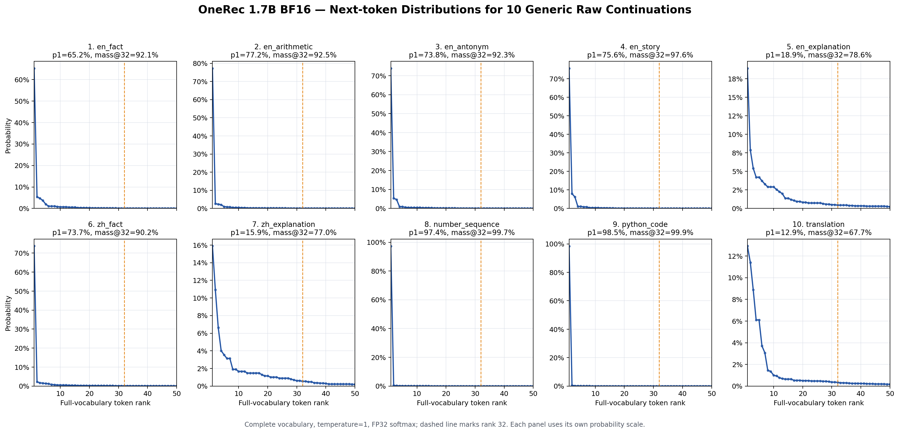

# 1.7B 模型通用 Prompt 输出分布 Probe

## 结论

在当前 OneRec 1.7B BF16 模型上，10 条人工构造的非推荐文本续写整体明显比此前观察到的 SID-A 决策更尖锐。10 条通用 prompt 的中位 Top-1 概率为 **73.77%**，中位 Top-32 概率质量为 **92.24%**；此前 5 条多正例 AD 样本的 SID-A 对应值分别只有 **4.71%** 和 **32.75%**。

通用 prompt 中包含不少天然确定的位置，例如事实答案、标点、空格和代码变量。即使只看三条相对开放的解释/翻译 prompt，其中位 Top-1 仍为 **15.90%**、Top-32 mass 为 **77.00%**、有效候选数为 **79.5**；SID-A 的对应中位数为 **4.71%**、**32.75%** 和 **601.2**。因此，这个小样本支持：**当前模型的 SID-A 决策确实比普通文本续写更加分散，量化扰动需要面对更大的有效候选集合。**

不过这只是定性 probe，不能直接代表原始通用 Qwen：模型已经经过推荐训练，10 条 prompt 是人工挑选的，旧 SID-A 对照也只有 5 条经过多正例筛选的样本。

## 设置

- 模型：当前仓库 `artifacts/models/1.7B`，BF16，不加载量化参数。
- 输入：10 条 raw continuation prompt，不使用 chat template。
- 比较位置：每条 prompt 末尾的下一个 token。
- 概率：完整模型词表、temperature=1、FP32 softmax，无 SID 词表限制。
- 曲线：完整词表 Top-50 token 按概率从高到低排列。
- 原始统计：[bf16_generic_prompts_top50.json](figures/bf16_generic_prompts_top50.json)

## 逐 Prompt 结果

| # | Prompt | Top-1 token | Top-1 | Top-32 mass | Top-50 mass | Entropy | 有效候选数 | 90% nucleus size |
|---:|---|---|---:|---:|---:|---:|---:|---:|
| 1 | `The capital of France is` | ` Paris` | 65.21% | 92.15% | 93.54% | 2.112 | 8.3 | 19 |
| 2 | `Two plus two equals` | ` four` | 77.20% | 92.46% | 94.00% | 1.657 | 5.2 | 16 |
| 3 | `The opposite of hot is` | ` cold` | 73.85% | 92.34% | 93.72% | 1.736 | 5.7 | 16 |
| 4 | `Once upon a time` | `,` | 75.63% | 97.65% | 98.24% | 1.264 | 3.5 | 4 |
| 5 | `Artificial intelligence is` | ` a` | 18.91% | 78.62% | 84.77% | 4.078 | 59.0 | 89 |
| 6 | `中国的首都是` | `北京` | 73.70% | 90.17% | 91.83% | 1.940 | 7.0 | 31 |
| 7 | `天空呈现蓝色的主要原因是` | `大气` | 15.90% | 77.00% | 82.42% | 4.376 | 79.5 | 169 |
| 8 | `1, 1, 2, 3, 5, 8,` | 空格 | 97.36% | 99.73% | 99.81% | 0.216 | 1.2 | 1 |
| 9 | `def add(a, b): return` | ` a` | 98.49% | 99.87% | 99.90% | 0.122 | 1.1 | 1 |
| 10 | `Translate 'hello' into French:` | ` "` | 12.93% | 67.73% | 71.88% | 4.972 | 144.3 | 874 |

第 8 条的 Top-1 是数字前的空格，第 4 条是固定短语后的逗号，因此它们反映的是 token 级格式确定性，而不是下一语义内容已经以同样高的概率确定。这里没有跳过空格或标点，因为真实自回归模型同样逐 token 解码。

## 与此前 SID-A 样本的直接对比

下表使用此前保留在 `docs/figures/bf16_ad_sid_a_top50*.json` 中的 5 条 BF16、多正例 AD 样本，统计口径与本次一致。

| 位置集合 | 数量 | Top-1 中位数 | Top-32 mass 中位数 | Top-50 mass 中位数 | Entropy 中位数 | 有效候选数中位数 |
|---|---:|---:|---:|---:|---:|---:|
| 通用 prompt，全部 | 10 | **73.77%** | **92.24%** | **93.63%** | **1.838** | **6.3** |
| 通用 prompt，较开放的 #5/#7/#10 | 3 | **15.90%** | **77.00%** | **82.42%** | **4.376** | **79.5** |
| AD SID-A，多正例样本 | 5 | **4.71%** | **32.75%** | **39.28%** | **6.399** | **601.2** |

即使排除明显确定的事实、格式和代码位置，SID-A 的分布仍然显著更平：

- 开放文本位置的 Top-1 中位概率约为 SID-A 的 **3.4 倍**；
- Top-32 已覆盖开放文本约 **77%** 的概率，而 SID-A 只有约 **33%**；
- SID-A 的有效候选数中位数约为开放文本的 **7.6 倍**。

这比单独比较 Top-1 更有解释力：SID-A 不只是第一名置信度较低，它在完整词表上还保留了很大的中后部概率质量。

## 关于 Margin@32

本次 10 条通用 prompt 中有 7 条的 `Margin@32` 为 0，此前 5 条 SID-A 样本也全部为 0。这说明“第 32/33 名 logit 完全相同”并不是 SID 推荐独有现象；BF16 LM-head 输出中存在相同离散 logit 值，在较低排名处很常见。因此不能仅凭 `Margin@32=0` 证明 SID 分布特殊。

目前更可靠的差异证据是概率质量、熵和有效候选数，而不是单个边界的精确相等。

## 对量化研究的含义

这个 probe 支持但尚未完全证明以下研究假设：

> 生成式推荐的 SID 位置需要在数百个有效候选之间做精确离散决策，而普通文本位置通常由更小的候选集合承载主要概率质量；因此，同样的量化扰动更容易改变 SID beam 中的候选集合和最终精确 item 命中。

后续如果需要把它作为论文证据，应把人工 prompt 扩展为公开文本数据上的数百至数千个自然语言位置，并随机抽取推荐测试集中的 SID-A/B/C 位置，报告分布和置信区间。本次 10 条结果适合作为方向性证据，不适合作为最终统计结论。
